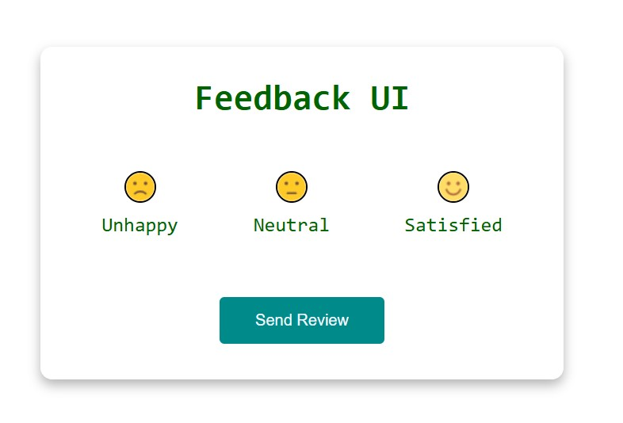
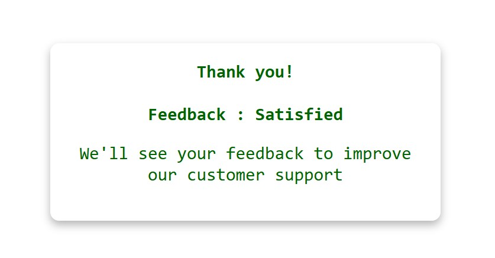

## 📝 Feedback UI  

A **Feedback UI** built using HTML, CSS, and JavaScript. This interactive interface allows users to provide feedback with a simple and engaging design. Perfect for collecting user opinions and improving user experience!  

## 🚀 Features  
- ✅ Clean and responsive UI for easy feedback submission  
- ✅ Interactive rating selection for user experience  
- ✅ Lightweight and fast performance  

## 🛠 Tech Stack  
HTML, CSS, JavaScript  

## 📷 Screenshots  
  
  

## 📌 How It Works  
1. Users select a **rating or feedback option**.  
2. The feedback is visually highlighted for confirmation.   
 
